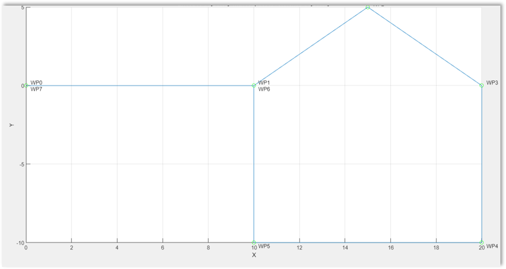

# SuperFin MAXFISH project of LabMacs

This project is based on the in the laboratory Mechatronics laboratory course of the Master degree in Computer and Automation Engineering (<a href="https://guide.univpm.it/af.php?lang=lang-ita&af=175842"> Marche Polytechnic University</a>)  

# Project description

The project involves developing a Navigation, Guidance, and Control System for the MAXFISH robotic fish. The focus is on creating a simulation environment using Matlab Simulink, enriched with a 3D graphic interface in the form of a Virtual Reality World, and developing a GUI on MATLAB in order to facilitate the use of the simulation and allow greater control over the data analysis.

The simulator deals with:

- Mathematical Model (Kinematics and Dynamics)
- Propulsion System
- NGC System:
  - Line of Sight (LOS) Guidance Law
  - Path following Control System (using PID)

The application GUI handles:
- Import the model parameters from an exel file
- Starting the simulation of the Simulink model
- Plot of the variables of interest in the simulation
- Plot of the trajectory taken by MAXFISH and the desired trajectory
- Calculation of the mean and Standard Deviation of the trajectory
- Starting the simulation of the tail kinematics on MATLAB.

For details look at the [Report](Documentation/Relazione_SuperFin_AA2023-24.pdf)

## 3D Model

The propulsion system of the prototype is composed by a single motor, which is responsible for the movement of the caudal fin. 


## Results

Waypoint-based path, consisting of a total of seven waypoints.

Trajectory of the Robotic Fish in the X-Y-Z plane:



# Requirements

- Matlab/Simulink Software Version R2023b or later
- The following MATLAB toolbox:
  - DSP System Toolbox
    <a href="https://it.mathworks.com/products/dsp-system.html" >
    DSP System Toolbox</a>
  - Signal Processing Toolbox
    <a href="https://www.mathworks.com/products/signal.html" >
    Signal Processing Toolbox</a>
  - Simulink 3D Animation 
    <a href="https://uk.mathworks.com/products/3d-animation.html" >
    Simulink 3D Animation</a>
  - Vehicle Dynamics Blockset.
    <a href="https://it.mathworks.com/products/vehicle-dynamics.html" >
    Vehicle Dynamics Blockset</a>

# Run the Project

Open the folder "MAXFISH model".
If you want to change the parameters of the 'MAXFISH' robotic fish simulation, open the file called 'data.xlsx'.

After that, open the file 'App.mlapp' to open the GUI application.

matlab command:

```matlab
open App.mlapp
```

If you want to open the simulation file directly, open the file "RoboticFish_NGC.slx".

matlab command:

```matlab
open RoboticFish_NGC.slx
```

# Credits

The project was carried out under the guidance of:

- <a href="https://www.linkedin.com/in/david-scaradozzi-761a9823/">Professor David Scaradozzi</a>
- <a href="https://www.linkedin.com/in/nicol%C3%B2-ciuccoli-11734a18b/">Eng. Nicolò Ciuccoli</a>
- <a href="https://www.linkedin.com/in/daniele-costa-77230641/">Eng. Daniele Costa</a>
